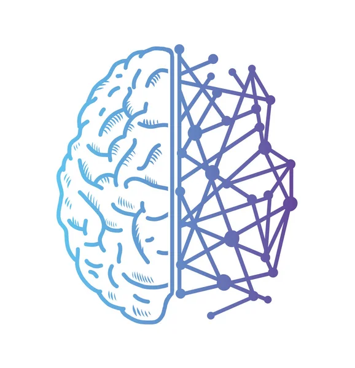
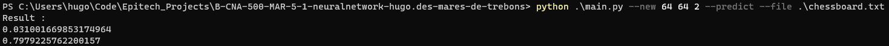
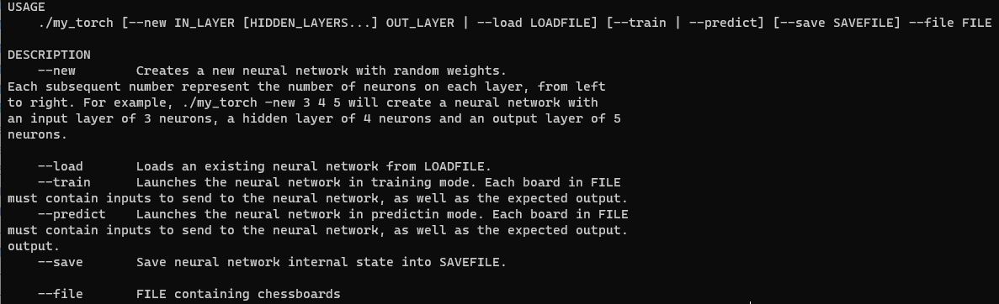

<a name="readme-top"></a>


<div align="center">
  <a href="https://github.com/EpitechPromo2026/B-CNA-500-MAR-5-1-neuralnetwork-hugo.des-mares-de-trebons">
    
  </a>

  <h3 align="center">MyTorch</h3>

  <p align="center">
    A Clash of Kings
    <br />
    <a href="https://hugo-dmdt.github.io/"><strong>Explore the docs »</strong></a>  <!-- lien vers github page -->
    <br />
  </p>
</div>


<details>
  <summary>Table of Contents</summary>
  <ol>
    <li>
      <a href="#about-the-project">About The Project</a>
      <ul>
        <li><a href="#built-with">Built With</a></li>
      </ul>
    </li>
    <li>
      <a href="#getting-started">Getting Started</a>
      <ul>
        <li><a href="#prerequisites">Prerequisites</a></li>
        <li><a href="#installation">Installation</a></li>
      </ul>
    </li>
    <li><a href="#usage">Usage</a></li>
    <li><a href="#contributing">Contributing</a></li>
    <li><a href="#contact">Contact</a></li>
    <li><a href="#acknowledgments">Contributing</a></li>
  </ol>
</details>


## About The Project


The aim of the MyTorch project is to create neural network that is able to take a chess board as input, and outputs the status of the game :
either a player wins (checkmate), a player has the other player’s king checked, there is a draw (stalemate) or the game is still on.
The MyTorch project has been conducted to use a machine learning based solution. As such, the project is using a neural network as its core function.


As a produced result, the basic neural network for the MyTorch project is composed of three layers : 64 neurons on the input layer, 64 on one hidden layer, and 2 neurons on the output layer. Such a choice is explained by the number of tiles on a chess board (64 tiles) : one input neuron for each tile. The hidden layer is having as much neurons as the input layer because it allows for an efficient calculation and sharper results. There is only one hidden layer because it permits for a much faster calculation speed while using the neural network, for an insignificant loss in accuracy. The ouput layer contains two neurons representing each the current state of the game : one for a checkmate state and the other for a non-checkmate state.


Here is a display of the results of a prediction using an untrained neural network :




<p align="right">(<a href="#readme-top">back to top</a>)</p>


### Built With

The MyTorch project was built using the flexible Python language, for its use convenience and launching velocity.

* [![Python][Python]][Python-url]

<p align="right">(<a href="#readme-top">back to top</a>)</p>


## Getting Started

Introducing oneself to the MyTorch project is a very easy process, just follow these few simple steps :

### Prerequisites

Make sure you have an updated python version on your machine.

Otherwise get the latest version on [Python official website](https://www.python.org/downloads/)


### Installation

1. First, clone the [repository](https://github.com/EpitechPromo2026/B-CNA-500-MAR-5-1-neuralnetwork-hugo.des-mares-de-trebons), or using the command line :
  ```sh
  git clone https://github.com/EpitechPromo2026/B-CNA-500-MAR-5-1-neuralnetwork-hugo.des-mares-de-trebons
  ```

2. Run the program :
  * Windows :
    ```sh
    python main.py --args...
    ```

  * Unix :
    Run the root Makefile :
    ```sh
    make
    ```
    And then run the main program :
    ```sh
    ./my_torch --args...
    ```


That's it ! You're ready to give a try to the MyTorch project by yourself !

Have a look to the [Documentation](https://hugo-dmdt.github.io/#usage) for more information on how the program runs.

<p align="right">(<a href="#readme-top">back to top</a>)</p>


## Usage

Following is the basic usage of the MyTorch project :





* One can easily generate a new neural network using the following :
```sh
./my_torch --new 64 64 2
```

Creates a new neural network with random weights.
Each subsequent number represent the number of neurons on each layer, from left
to right. For example, the previous example will create a neural network with
an input layer of 64 neurons, a hidden layer of 64 neurons and an output layer of 2
neurons.


* One can easily load a neural network which has been previoulsy saved, from an existing file :
```sh
./my_torch --load file.txt
```
A typical use of this option is to load back a neural network which has been previously trained, in order to apply a situation to it and get actual results.


* One can train a neural network previously created or loaded to sharpen its predictions :
```sh
./my_torch --train
```
This option launches the neural network in training mode. Each board in the training file (see the '--file' option beneath) should contain inputs to send to the neural network and separated by two new lines, as well as the expected output. Looking like such :
```
RES: 0-1
CHECKMATE: True
FEN: 8/8/5p1p/2k3pb/6q1/6K1/2r5/1R6 w

RES: 1/2-1/2
CHECKMATE: False
FEN: 8/8/8/8/4K3/4N2p/3k4/8 b
```

RES : indicates the result of the chess game. Left part is the white player and right part is the black player. 0 indicates a defeat, 1 a victory. A draw is indicated as 1/2-1/2.

CHECKMATE : indicates if the specified board depicts a checkmate state.

FEN : indicates the FEN representation of the chess board, each pieces of the board. A raw number represents the amount of empty tiles.

The 'w' at the end of the FEN representation can be either a 'w' or a 'b', simply meaning the next turn's player.

* One can make use of the neural network to predict the outcome of a chess game given its board :
```sh
./my_torch --predict
```

This option launches the neural network in prediction mode. The training file (see the '--file' option beneath) should contain the actual state of the game, such as :
```
RES: 0-1
CHECKMATE: True
FEN: 8/8/5p1p/2k3pb/6q1/6K1/2r5/1R6 w
```

Each fields meaning are exactly the same as for the '--train' long option.

The neural network will the output the predicted state of the game.


* One can easily save a neural network to file, to keep its internal state for later use :
```sh
./my_torch --save file.txt
```

This option is typicaly use along the '--new' and '--train' options to save the internal state of the neural network for later use.
The generated save file is typicaly used along the '--load' option to retreive back the state of the neural network for use.


* One can easily give a chess board to the neural network thanks to the following :
```sh
./my_torch --file file.txt
```

This option is typicaly used along the '--train' and '--predict' options to give inputs to the neural network.


<p align="right">(<a href="#readme-top">back to top</a>)</p>


## Contributing

Contributions are what make the open source community such an amazing place to learn, inspire, and create. Any contributions you make are **greatly appreciated**.

If you have a suggestion that would make this better, please fork the repository and create a pull request.
Don't forget to give the project a star! Thanks again!

1. Fork the Project
2. Create your Feature Branch (`git checkout -b feature/AmazingFeature`)
3. Commit your Changes (`git commit -m 'Add some AmazingFeature'`)
4. Push to the Branch (`git push origin feature/AmazingFeature`)
5. Open a Pull Request


Or don't hesitate to directly contact us for any discussion on the subject.

<p align="right">(<a href="#readme-top">back to top</a>)</p>


## Contact

Feel free to contact us about anything project related, or other stuff you would like to discuss


Hugo Des Mares de Trébons - hugo.des-mares-de-trebons@epitech.eu

Ryan Thouvenel - ryan.thouvenel@epitech.eu


Project Link: [https://github.com/EpitechPromo2026/B-CNA-500-MAR-5-1-neuralnetwork-hugo.des-mares-de-trebons](https://github.com/EpitechPromo2026/B-CNA-500-MAR-5-1-neuralnetwork-hugo.des-mares-de-trebons)

<p align="right">(<a href="#readme-top">back to top</a>)</p>


## Acknowledgments


* [README template](https://github.com/othneildrew/Best-README-Template/tree/master)

<p align="right">(<a href="#readme-top">back to top</a>)</p>


[screenshot]: docs/network.svg

[Python]: https://img.shields.io/badge/python-3670A0?style=for-the-badge&logo=python&logoColor=ffdd54
[Python-url]: https://www.python.org/
